# Using rerddap to Access Data from ERDDAP™ Servers

## Introduction

`rerddap` is a general purpose R client for working with ERDDAP™
servers. ERDDAP™ is a web service developed by Bob Simons of NOAA. At
the time of this writing, there are over a hundred ERDDAP™ servers
(though not all are public facing) providing access to literally
petabytes of data and model output relevant to oceanography,
meteorology, fisheries and marine mammals, among other areas. ERDDAP™ is
a simple to use, RESTful web service, that allows data to be subset and
returned in a variety of formats.

This vignette goes over some of the nuts and bolts of using the
`rerddap` package, and shows the power of the combination of the
`rerddap` package with ERDDAP™ servers. Examples are provided for both
gridded and table datasets from several ERDDAP™s and demonstrate many of
the options available.

Some features added in version 1.2.0 of `rerddap` include support for
downloading
[`tabledap()`](https://docs.ropensci.org/rerddap/reference/tabledap.md)
requests as parquet files, which can greatly reduce the size of the
download (this only works for ERDDAP™ server greater or equal to version
2.25), inclusion of units in the dataframe created by
[`tabledap()`](https://docs.ropensci.org/rerddap/reference/tabledap.md),
and all variables in a dataframe created by
[`tabledap()`](https://docs.ropensci.org/rerddap/reference/tabledap.md)
now have the datatype defined in the ERDDAP™ server, that is for example
latitude and longitude will always be numbers, not character strings as
in the past.

Some new features in version 1.3.0 of `rerddap` include a function to
estimate the size of a
[`griddap()`](https://docs.ropensci.org/rerddap/reference/griddap.md)
request before actually making the request; the ability to download
parquet files using
[`griddap()`](https://docs.ropensci.org/rerddap/reference/griddap.md)
([`tabledap()`](https://docs.ropensci.org/rerddap/reference/tabledap.md)
has had this ability for a while); and a discussion and some tips on
reading a
[`griddap()`](https://docs.ropensci.org/rerddap/reference/griddap.md)
object into `terra::raster()`.

The option to download files as parquet files means the
[`tabledap()`](https://docs.ropensci.org/rerddap/reference/tabledap.md)
function definition is slightly changed, it is now:

``` r
tabledap <- function(x, ..., fields=NULL, distinct=FALSE, orderby=NULL,
  orderbymax=NULL, orderbymin=NULL, orderbyminmax=NULL, units=NULL, fmt = 'csv',
  url = eurl(), store = disk(), callopts=list())
```

Since the “fmt” argument is optional and defaults to “csv”, which was
used in previous versions of
[`tabledap()`](https://docs.ropensci.org/rerddap/reference/tabledap.md),
this change will not affect existing scripts. In order to download as a
parquet file, just set “fmt = ‘parquet’ in the
[`tabledap()`](https://docs.ropensci.org/rerddap/reference/tabledap.md)
options. See below for an example.

Now that
[`griddap()`](https://docs.ropensci.org/rerddap/reference/griddap.md)
has the option to download the response as a parquet file, the only
difference is that “fmt =” has three options “c(‘nc’, ‘csv’, ‘parquet’)”
with “nc” (that is a netCDF file) as the default. This does not affect
existing code.

## Installation

The first step is to install the `rerddap` package, the stable version
is available from CRAN:

``` r

install.packages("rerddap")
```

or the development version can be installed from GitHub:

``` r

remotes::install_github("ropensci/rerddap")
```

and to load the library:

``` r

library("rerddap")
```

Besides `rerddap` the following libraries are used in this vignette:

``` r

library("dplyr")
library("ggplot2")
library("mapdata")
library("ncdf4")
library("plot3D")
```

Code chunks are always given with the required libraries so that the
chunks are more standalone in nature. Many of the plots use an early
version of the `cmocean` colormaps designed by Kristen Thyng (see
<https://matplotlib.org/cmocean/> and
<https://github.com/matplotlib/cmocean>) translated from the original
Python implementation. However, there is now a `cmocean` package for R.
As past scripts may use the built-in color palette it is maintained
here, but use of the `cmocean` package is advisable as it is kept
up-to-date. In the present version of the `cmocean` package the names
have changed, what is “temperature” here is now “thermal”, “chlorophyll”
is now “algae”, and “salinity” is now “haline”.

## The main `rerddap` function definitions

The complete list of `rerddap` functions can be seen by looking at he
`rerddap` package help:

``` r

?rerddap
```

and selecting the index of the package. The main functions used here
are:

- the list of servers `rerddap` knows about - `server()`
- search an ERDDAP™ server for terms -
  `ed_search(query, page = NULL, page_size = NULL, which = "griddap", url = eurl(), ...)`
- search a list of ERDDAP™ servers for terms -
  `global_search(query, server_list, which_service)`
- get a list of datasets on an ERDDAP™ server -
  `ed_datasets(which = "tabledap", url = eurl())`
- obtain information about a dataset -
  `info(datasetid, url = eurl(), ...)`
- estimate the size of a
  [`griddap()`](https://docs.ropensci.org/rerddap/reference/griddap.md)
  request without making the request -
  `estimate_griddap_sizen(info,..., fields= "all", stride = 1L, spacing = list(), verbose = TRUE)`
- extract data from a griddap dataset -
  `griddap(x, ..., fields = "all", stride = 1, fmt = "nc", url = eurl(), store = disk(), read = TRUE, callopts = list())`
- extract data from a tabledap dataset -
  `tabledap(x, ..., fields = NULL, distinct = FALSE, orderby = NULL, orderbymax = NULL, orderbymin = NULL, orderbyminmax = NULL, units = NULL, url = eurl(), store = disk(), callopts = list())`

Care should be used with the functions
[`ed_search()`](https://docs.ropensci.org/rerddap/reference/ed_search.md),
[`ed_datasets()`](https://docs.ropensci.org/rerddap/reference/ed_search.md)
and
[`global_search()`](https://docs.ropensci.org/rerddap/reference/global_search.md).
The default ERDDAP™ has over 9,000 datasets, most of which are grids, so
that a list of all the gridded datasets can be quite long. Even a seemly
reasonable search:

``` r

whichSST <- ed_search(query = "SST")
```

returns about 1000 responses. The more focused query:

``` r

whichSST <- ed_search(query = "SST MODIS")
```

still returns 172 responses. If the simple search doesn’t narrow things
enough, look at the advanced search function
[`ed_search_adv()`](https://docs.ropensci.org/rerddap/reference/ed_search_adv.md).

## The basic steps in finding and obtaining the desired data

1.  Find the dataset on an ERDDAP™ server
    ([`servers()`](https://docs.ropensci.org/rerddap/reference/servers.md),
    [`ed_search()`](https://docs.ropensci.org/rerddap/reference/ed_search.md),
    [`ed_datasets()`](https://docs.ropensci.org/rerddap/reference/ed_search.md)
    ).
2.  Get the needed information about the dataset
    ([`info()`](https://docs.ropensci.org/rerddap/reference/info.md) )
3.  Think about what you are going to do.
4.  Make the request for the data
    ([`griddap()`](https://docs.ropensci.org/rerddap/reference/griddap.md)
    or
    [`tabledap()`](https://docs.ropensci.org/rerddap/reference/tabledap.md)
    ).

We discuss each of these steps in more detail, and then look at some
realistic uses of the package.

### Finding the data you want

Given a base ERDDAP™ URL, the function
[`ed_search()`](https://docs.ropensci.org/rerddap/reference/ed_search.md)
searches the server for the given search terms. The default ERDDAP™
server is <https://upwell.pfeg.noaa.gov/erddap/>. Alternately, the
function
[`global_search()`](https://docs.ropensci.org/rerddap/reference/global_search.md)
will search a list of ERDDAP™ servers for the given search terms. The
function
[`ed_datasets()`](https://docs.ropensci.org/rerddap/reference/ed_search.md)
lists the datasets available from the given ERDDAP™ server.

The first way to find a dataset is to browse the built-in web page for a
particular ERDDAP™ server. A list of some of the publicly available
ERDDAP™ servers can be obtained from the `rerddap` command:

``` r

servers()
#> # A tibble: 58 × 4
#>    name                                                  short_name url   public
#>    <chr>                                                 <chr>      <chr> <lgl> 
#>  1 Voice of the Ocean                                    VOTO       http… TRUE  
#>  2 St. Lawrence Global Observatory - CIOOS | Observatoi… SLGO-OGSL  http… TRUE  
#>  3 CoastWatch West Coast Node                            CSWC       http… TRUE  
#>  4 ERDDAP at the Asia-Pacific Data-Research Center       APDRC      http… TRUE  
#>  5 NOAA's National Centers for Environmental Informatio… NCEI       http… TRUE  
#>  6 Biological and Chemical Oceanography Data Management… BCODMO     http… TRUE  
#>  7 European Marine Observation and Data Network (EMODne… EMODnet    http… TRUE  
#>  8 European Marine Observation and Data Network (EMODne… EMODnet P… http… TRUE  
#>  9 Marine Institute - Ireland                            MII        http… TRUE  
#> 10 CoastWatch Caribbean/Gulf of Mexico Node              CSCGOM     http… TRUE  
#> # ℹ 48 more rows
```

The list of ERDDAP™ servers is based on the list maintained at the
*Awesome ERDDAP™* site compiled by the Irish Marine Institute.

### Get the needed information about the dataset (`rerddap::info()` )

One of the main advantages of a service such as ERDDAP™ is that you only
need to download the subset of the data you desire, rather than the
entire dataset, which is both convenient and essential for large
datasets. The underlying data model in ERDDAP™ is quite simple -
everything is either a (multi-dimensional) grid (think R array) or a
table (think a simple spreadsheet or data table). Grids are subset using
the function
[`griddap()`](https://docs.ropensci.org/rerddap/reference/griddap.md)
and tables are subset using the function
[`tabledap()`](https://docs.ropensci.org/rerddap/reference/tabledap.md).

If you know the datasetID of the data you are after, and are unsure if
it is a grid or a table, there are several ways to find out. We look at
two datasets, ‘jplMURSST41’ and ‘siocalcofiHydroCasts’ to see how this
is done. The first method is to use the `rerddap` function
[`browse()`](https://docs.ropensci.org/rerddap/reference/browse.md)

``` r

browse('jplMURSST41')
browse('siocalcofiHydroCast')
```

which brings up information on the datasets in the browser, in the first
case the “data” link is under “griddap”, the second is under “tabledap”.

The other method is to use the `rerddap` function `info`:

``` r

info('jplMURSST41')
info('siocalcofiHydroCast')
```

Notice the information on ‘jplMURSST41’ lists the dimensions (that is a
grid) while that of ‘siocalcofiHydroCasts’ does not (that is a table).

### Think about what you are going to do.

This may seem to be a strange step in the process, but it is important
because many of the datasets are high-resolution, and data requests can
get very large, very quickly. As an example, based on a real use case.
The MUR SST ( Multi-scale Ultra-high Resolution (MUR) SST Analysis
fv04.1, see
<https://coastwatch.pfeg.noaa.gov/erddap/griddap/jplMURSST41.html> ) is
a daily, high-quality, high-resolution sea surface temperature (SST)
product. The user wanted the MUR data for a 2x2-degree box, daily for a
year. That seems innocuous enough. Except that MUR SST has a resolution
of one-hundredth of degree. Assuming a binary representation of the
data, with 8-bytes per value, do the math:

``` r

100*100*4*8*365
#> [1] 116800000
```

Yes, 116,800,000 bytes or roughly 115MB for that request. Moreover the
user wanted the data as a .csv file, which usually makes the resulting
file 8-10 times larger, so now we are over a 1GB for the request. Even
more so, there are four parameters in that dataset, and in
[`griddap()`](https://docs.ropensci.org/rerddap/reference/griddap.md) if
“fields” are not enumerated, all fields are downloaded, therefore the
resulting files will be four times as large as given above.

The gist of this is to think about your request before you make it. Do a
little mental math to get a rough estimate of the size of the download.
There are times receiving the data as a .csv file is convenient, but
make certain the request will not be too large. For larger requests,
obtain the data as netCDF files. By default,
[`griddap()`](https://docs.ropensci.org/rerddap/reference/griddap.md)
“melts”” the data into a dataframe, so a .csv only provides a small
convenience. But for really large downloads, you should select the
option in
[`griddap()`](https://docs.ropensci.org/rerddap/reference/griddap.md) to
not read the data into memory, and use instead the `netCDF4` package to
read in the data, as this allows for only reading in parts of the data
at a time. [Below](#ncdf4) we provide a brief tutorial on reading in
data using the `ncdf4` package.

There is now a function
[`estimate_griddap_size()`](https://docs.ropensci.org/rerddap/reference/estimate_griddap_size.md)
that can give a rough estimate of the size of a
[`griddap()`](https://docs.ropensci.org/rerddap/reference/griddap.md)
before you make the request. For example:

``` r

myURL <- "https://coastwatch.pfeg.noaa.gov/erddap/"
info <- rerddap::info("erdMH1chla8day", url = myURL)
estimate_griddap_size(info,
  latitude  = c(30, 50),
  longitude = c(-140, -110),
  time      = c("2020-01-01", "2020-12-31")
  )
```

gives the response:

``` r
=== griddap request size estimate ===
  Dataset  : erdMH1chla8day 
  All dims : time, latitude, longitude 

  Dimension                  n_pts     strided  spacing / source
----------------------------------------------------------------- 
  time                          46          46  690032.432432432 s  [nValues / actual_range]
  latitude                     481         481  0.0416666658948831  [NC_GLOBAL::geospatial_lat_resolution]
  longitude                    720         720  0.0416666743836092  [NC_GLOBAL::geospatial_lon_resolution]
----------------------------------------------------------------- 
  Total cells (constrained) : 15,930,720

  Variable                        dtype       size
  chlorophyll                     float       60.8 MB
----------------------------------------------------------------- 
  Estimated size (NetCDF3, no compression) : 60.8 MB
```

### Make the request for the data (`griddap()` or `tabledap()` ).

#### Requesting gridded data using `griddap()`

Like an R array, ERDDAP™ grids are subsetted by setting limits on the
dimension variables, the difference being that a subset is defined in
coordinate space (latitude values, longitude values, time values etc)
rather than array space as is done with R arrays. Thus for ‘jplMURSST41’
if the desired area of the data extract is latitude limits of (22N,
51N), longitude limits of (140W, 105W), and time limits of (2017-01-01,
2017-01-02) the following would be passed to the function
[`griddap()`](https://docs.ropensci.org/rerddap/reference/griddap.md):

``` r

latitude = c(22., 51.)
longitude = c(-140., -105)
time = c("2017-01-01", "2017-01-02")
```

A full
[`griddap()`](https://docs.ropensci.org/rerddap/reference/griddap.md)
request to retrieve “analysed_sst” with these constraints is:

``` r

sstInfo <- info('jplMURSST41')
murSST <- griddap(sstInfo, latitude = c(22., 51.), longitude = c(-140., -105), time = c("2017-01-01", "2017-01-02"), fields = 'analysed_sst')
```

##### Thinning the request - Strides

Strides allow to retrieve data within a coordinate bound only at every
“n” values, where “n” is an integer - think of the “by” part of the R
function [`seq()`](https://rdrr.io/r/base/seq.html). This is useful say
for a monthly dataset where only the December values are desired, or you
want to sub-sample a very high-resolution dataset. The default is a
stride of 1 for all dimensions. If you want to change the stride value
in any dimension, then a value must be given for all dimensions. So in
the previous example, if only every fifth longitude is desired, the call
would be:

``` r

murSST <- griddap(sstInfo, latitude = c(22., 51.), longitude = c(-140., -105), time = c("2017-01-01", "2017-01-02"), stride = c(1, 1, 5), fields = 'analysed_sst')
```

Strides are calculated in array space, not in coordinate space - so the
stride is not skipping say a number of degrees of longitude, rather the
stride is skipping a number of values of the array index - if longitude
is thought of as an array, then every fifth value is used. There are
many cases where having strides work in coordinate space would be handy,
but it can cause a lot of problems. Consider the case where neither the
starting longitude, nor the ending longitude in the request lie on the
actual data grid, and the stride is in coordinate units in such a way
that no value requested actually lies on an actual grid value. This
would be equivalent to the more complicated problem of data re-gridding
and data interpolation.

When ERDDAP™ receives a request where the bounds are not on the actual
dataset grid, ERDDAP™ finds the closest values on the grid to the
requested bounds, and returns those points and all grid points in
between. This plus requiring strides to be defined in array space
guarantees that every value returned lies on the dataset grid.

#### Requesting table data using `tabledap()`

Tables in ERDDAP™ are subset by using “constraint expressions” on any
variable in the table. The valid operators are =, != (not equals), =~ (a
regular expression test), \<, \<=, \>, and \>=. The constraint is
constructed as the parameter on the left, value on the right, and the
operator in the middle, all within a set of quotes. For example, if in
the SWFSC/FRD trawl catch data (datasetID ‘FRDCPSTrawlLHHaulCatch’),
only sardines for 2010 were desired, the following constraints would be
set in the
[`tabledap()`](https://docs.ropensci.org/rerddap/reference/tabledap.md)
call:

``` r

'time>=2010-01-01'
'time<=2010-12-31'
'scientific_name="Sardinops sagax"'
```

Note that in
[`tabledap()`](https://docs.ropensci.org/rerddap/reference/tabledap.md)
character strings usually must be passed as “double-quoted”, as seen in
the example with the scientific name. A full
[`tabledap()`](https://docs.ropensci.org/rerddap/reference/tabledap.md)
request to retrieve ‘latitude’, ‘longitude’, ‘time’, ‘scientific_name’,
and ‘subsample_count’ with these constraints is:

``` r

CPSinfo <- info('FRDCPSTrawlLHHaulCatch')
sardines <- tabledap(CPSinfo, fields = c('latitude',  'longitude', 'time', 'scientific_name', 'subsample_count'), 'time>=2010-01-01', 'time<=2010-12-31', 'scientific_name="Sardinops sagax"' )
```

##### `tabledap()` and regular expressions

As mentioned above, the
[`tabledap()`](https://docs.ropensci.org/rerddap/reference/tabledap.md)
function allows using a regular expression to subset the variable of
interest. While regular expressions can be used for variables that are
not strings (see
<https://coastwatch.pfeg.noaa.gov/erddap/tabledap/documentation.html#query>),
they are most useful for subsetting strings, as numerical variables have
a natural ordering that are better suited for the more standard
constraint expressions.

As an example, in the CPS trawl survey dataset above, to find all the
entries where the species names contains “Oncorhynchus” (species of
Pacific salmon and Pacific Trout):

``` r
CPSinfo <- info('FRDCPSTrawlLHHaulCatch')
oncorhynchus <- tabledap(CPSinfo, 
                         fields = c('latitude',  'longitude', 'time', 'scientific_name', 
                         'subsample_count'), 
                         'scientific_name=~"Oncorhynchus.*"'
                         )
head(oncorhynchus)

<ERDDAP™ tabledap> FRDCPSTrawlLHHaulCatch
   Path: [/var/folders/46/jyz1mm5x5bvbf59b5g8f7f580000gn/T//RtmpLpXHMI/R/rerddap/0ce4939b104016aafebee121efeeba00.csv]
   Last updated: [2024-10-29 11:14:10.975094]
   File size:    [0.02 mb]
# A tibble: 6 × 5
  latitude longitude time                scientific_name      subsample_count
     <dbl>     <dbl> <dttm>              <chr>                          <int>
1     43.0     -125. 2003-07-09 06:08:00 Oncorhynchus kisutch               1
2     43.0     -125. 2003-07-09 07:08:00 Oncorhynchus kisutch               1
3     43       -125. 2003-07-09 08:07:00 Oncorhynchus                       1
4     46.0     -124. 2003-07-12 08:52:00 Oncorhynchus                      10
5     46.0     -124. 2003-07-12 10:24:00 Oncorhynchus                      10
6     46.0     -124. 2003-07-12 12:09:00 Oncorhynchus                       2
```

## More detailed examples

Now that the basics of using
[`griddap()`](https://docs.ropensci.org/rerddap/reference/griddap.md)
and
[`tabledap()`](https://docs.ropensci.org/rerddap/reference/tabledap.md)
have been covered, below are more detailed examples of the use of these
commands and how they can fit into a workflow.

### `griddap()` examples

[`griddap()`](https://docs.ropensci.org/rerddap/reference/griddap.md)
now supports downloading the data as a parquet file, though the default
is still a netCDF3 file. There are trade-offs as to which would be the
best choice. The relative size of the downloads appears to be quite
variable, so there is no hard and fast rule. The parquet file has the
advantage that the data is “melted” at the server end, rather than after
it is downloaded, as is done with a netCDF file, but again which will
ultimately be faster is variable. If you plan on using the downloaded
file and are not comfortable accessing netCDF files, than using the
parquet option has an advantage, but netCDF files have the advantage of
random access so that only a part of the file need be read into memory.
A netCDF file also preserves the gridded structure of the data, which
can be a real advantage depending on your use cases.

#### MUR SST

MUR (Multi-scale Ultra-high Resolution) is an analyzed SST product at
0.01-degree resolution going back to 2002, providing one of the longest
satellite based time series at such high resolution (see
<https://www.earthdata.nasa.gov/data/catalog/pocloud-mur-jpl-l4-glob-v4.1-4.1>).
The latest data available for a region off the west coast can be
extracted and plotted by:

``` r

require("ggplot2")
require("mapdata")
require("rerddap")
sstInfo <- info('jplMURSST41')
# get latest daily sst
murSST <- griddap(sstInfo, latitude = c(22., 51.), longitude = c(-140., -105), time = c('last','last'), fields = 'analysed_sst')
mycolor <- colors$temperature
w <- map_data("worldHires", ylim = c(22., 51.), xlim = c(-140, -105))
ggplot(data = murSST$data, aes(x = longitude, y = latitude, fill = analysed_sst)) +
    geom_polygon(data = w, aes(x = long, y = lat, group = group), fill = "grey80") +
    geom_raster(interpolate = FALSE) +
    scale_fill_gradientn(colours = mycolor, na.value = NA) +
    theme_bw() + ylab("latitude") + xlab("longitude") +
    coord_fixed(1.3, xlim = c(-140, -105),  ylim = c(22., 51.)) + ggtitle("Latest MUR SST")
```

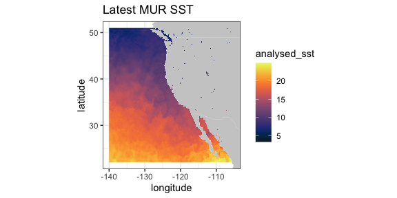

#### VIIRS SST and Chlorophyll

VIIRS (Visible Infrared Imaging Radiometer Suite) is a scanning
radiometer, that collects visible and infrared imagery and radiometric
measurements of the land, atmosphere, cryosphere, and oceans. VIIRS data
is used to measure cloud and aerosol properties, ocean color, sea and
land surface temperature, ice motion and temperature, fires, and the
Earth’s albedo. Both NASA and NOAA provide VIIRS-based high resolution
SST and chlorophyll products.

ERD provides a 3-day composite SST product at 750 meter resolution
developed from a real-time NOAA product. The most recent values can be
obtained by setting “time” to be “last”. (Note that R sees the
latitude-longitude grid as slightly uneven (even though it is in fact
even), and that produces artificial lines in
[`ggplot2::geom_raster()`](https://ggplot2.tidyverse.org/reference/geom_tile.html).
In order to remove those lines, the latitude-longitude grid is remapped
to an evenly-space grid.)

``` r

require("ggplot2")
require("mapdata")
require("rerddap")
sstInfo <- info('erdVHsstaWS3day', url = "https://coastwatch.pfeg.noaa.gov/erddap/")
# get latest 3-day composite sst
viirsSST <- griddap(sstInfo, latitude = c(41., 31.), longitude = c(-128., -115), time = c('last','last'), fields = 'sst')
# remap latitiudes and longitudes to even grid
myLats <- unique(viirsSST$data$latitude)
myLons <- unique(viirsSST$data$longitude)
myLats <- seq(range(myLats)[1], range(myLats)[2], length.out = length(myLats))
myLons <- seq(range(myLons)[1], range(myLons)[2], length.out = length(myLons))
# melt these out to full grid
mapFrame <- expand.grid(x = myLons, y = myLats)
mapFrame$y <- rev(mapFrame$y)
# form a frame with the new values and the data
tempFrame <- data.frame(sst = viirsSST$data$sst, lat = mapFrame$y, lon = mapFrame$x)
mycolor <- colors$temperature
w <- map_data("worldHires", ylim = c(30., 42.), xlim = c(-128, -114))
ggplot(data = tempFrame, aes(x = lon, y = lat, fill = sst)) +
    geom_polygon(data = w, aes(x = long, y = lat, group = group), fill = "grey80") +
    geom_raster(interpolate = FALSE) +
    scale_fill_gradientn(colours = mycolor, na.value = NA) +
    theme_bw() + ylab("latitude") + xlab("longitude") +
    coord_fixed(1.3, xlim = c(-128, -114),  ylim = c(30., 42.)) + ggtitle("Latest VIIRS 3-day SST")
```

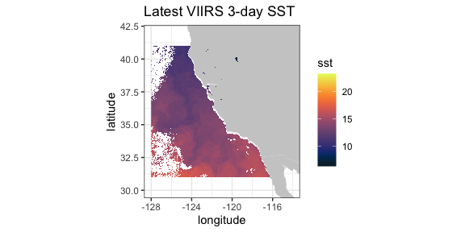

A time series from the same dataset at a given location, here (36.,
-126.):

``` r

require("ggplot2")
require("rerddap")
viirsSST1 <- griddap(sstInfo, latitude = c(36., 36.), 
                     longitude = c(-126., -126.), 
                     time = c('2015-01-01','2015-12-31'), fields = 'sst')
tempTime <- as.Date(viirsSST1$data$time, origin = '1970-01-01', tz = "GMT")
tempFrame <- data.frame(time = tempTime, sst = viirsSST1$data$sst)
```

``` r

ggplot(tempFrame, aes(time, sst)) + 
  geom_line() + 
  theme_bw() + 
  ylab("sst") +
  ggtitle("VIIRS SST at (36N, 126W)")
```

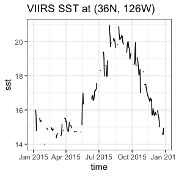

A similar 3-day composite for chloropyll for the same region from a
scientific quality product developed by NOAA:

``` r

require("ggplot2")
require("mapdata")
require("rerddap")
chlaInfo <- info('erdVHNchla3day')
viirsCHLA <- griddap(chlaInfo, latitude = c(41., 31.), 
                     longitude = c(-128., -115), time = c('last','last'), 
                     fields = 'chla')
```

``` r

mycolor <- colors$chlorophyll
w <- map_data("worldHires", ylim = c(30., 42.), xlim = c(-128, -114))
ggplot(data = viirsCHLA$data, aes(x = longitude, y = latitude, fill = log(chla))) +
  geom_polygon(data = w, aes(x = long, y = lat, group = group), fill = "grey80") +
  geom_raster(interpolate = FALSE) +
  scale_fill_gradientn(colours = mycolor, na.value = NA) +
  theme_bw() + ylab("latitude") + xlab("longitude") +
  coord_fixed(1.3, xlim = c(-128, -114),  ylim = c(30., 42.)) + 
  ggtitle("Latest VIIRS 3-day Chla")
```

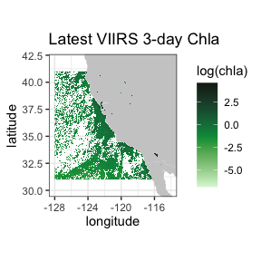

#### Temperature at 70m in the north Pacific from the SODA model output

This example extracts data from a 4-D dataset (results from the “Simple
Ocean Data Assimilation (SODA)” model - see <https://soda.umd.edu>), and
illustrates the case where the z-coordinate does not have the default
name “altitude”. Water temperature at 70m depth is extracted for the
North Pacific Ocean.

``` r

require("rerddap")
dataInfo <- rerddap::info('hawaii_d90f_20ee_c4cb')
xpos <- c(135.25, 240.25)
ypos <- c(20.25, 60.25)
zpos <- c(70.02, 70.02)
tpos <- c('2010-12-15', '2010-12-15')
soda70 <- griddap(dataInfo,  longitude = xpos, latitude = ypos, 
                  time = tpos, depth = zpos, fields = 'temp' )
```

Since the data cross the dateline, it is necessary to use the Pacific
Ocean centered “world2Hires” continental outlines in the package
`mapdata`. Unfortunately there is a small problem where the outlines
from certain countries wrap and mistakenly appear in plots, and those
countries must be removed, see code below.

``` r

require("ggplot2")
require("mapdata")
xlim <- c(135, 240)
ylim <- c(20, 60)
my.col <- colors$temperature
## Must do a kludge to remove countries that wrap and mess up the plot
w1 <- map("world2Hires", xlim = c(135, 240), ylim = c(20, 60), fill = TRUE, plot = FALSE)
remove <- c("UK:Great Britain", "France", "Spain", "Algeria", "Mali", "Burkina Faso", "Ghana", "Togo")
w <- map_data("world2Hires", regions = w1$names[!(w1$names %in% remove)], ylim = ylim, xlim = xlim)
myplot <- ggplot() +
    geom_raster(data = soda70$data, aes(x = longitude, y = latitude, fill = temp), interpolate = FALSE) +
    geom_polygon(data = w, aes(x = long, y = lat, group = group), fill = "grey80") +
    theme_bw() + scale_fill_gradientn(colours = my.col, na.value = NA, limits = c(-3,30), name = "temperature") +
    ylab("latitude") + xlab("longitude") +
    coord_fixed(1.3, xlim = xlim, ylim = ylim) +
    ggtitle(paste("70m temperature ", soda70$data$time[1]))
myplot
```

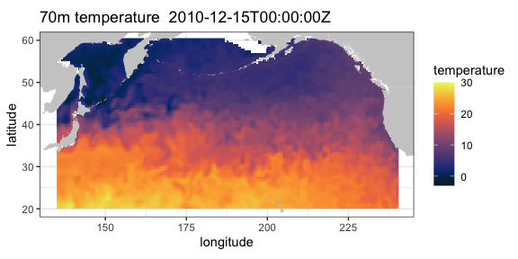

#### Irish Marine Institute

The Irish Marine Institute has an ERDDAP™ server at
<https://erddap.marine.ie/erddap>. Among other datasets, they have
hourly output from a model of the North Atlantic ocean, with a variety
of ocean related parameters, see the dataset *IMI_NEATL*. To obtain the
latest sea surface salinity for the domain of the model:

``` r

require("rerddap")
urlBase <- "https://erddap.marine.ie/erddap/"
parameter <- "sea_surface_salinity"
sssTimes <- c("last", "last")
sssLats <- c(48.00625, 57.50625)
sssLons <- c(-17.99375, -1.00625)
dataInfo <- rerddap::info("IMI_NEATL", url = urlBase)
NAtlSSS <- griddap(dataInfo, longitude = sssLons, latitude = sssLats, time = sssTimes, fields = parameter, url = urlBase)
```

and the extracted data plotted:

``` r

require("ggplot2")
require("mapdata")
xlim <- c(-17.99375, -1.00625)
ylim <- c(48.00625, 57.50625)
my.col <- colors$salinity
w <- map_data("worldHires", ylim = ylim, xlim = xlim)
myplot <- ggplot() +
    geom_raster(data = NAtlSSS$data, aes(x = longitude, y = latitude, fill = sea_surface_salinity), interpolate = FALSE) +
    geom_polygon(data = w, aes(x = long, y = lat, group = group), fill = "grey80") +
    theme_bw() + scale_fill_gradientn(colours = my.col, na.value = NA, limits = c(34, 36), name = "salinity") +
    ylab("latitude") + xlab("longitude") +
    coord_fixed(1.3, xlim = xlim, ylim = ylim) +
    ggtitle(paste("salinity", NAtlSSS$data$time[1]))
myplot
```

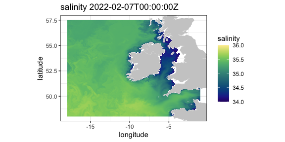

#### IFREMER

The French agency IFREMER also has an ERDDAP™ server. Here salinity
climatologies at 75 meters off the west coast of the United States,
calculated from the World Ocean Database 2013 using the program DIVA, is
extracted and plotted.

``` r

require("rerddap")
urlBase <- "https://www.ifremer.fr/erddap/"
parameter <- "Salinity"
ifrTimes <- c("2010-05-16", "2010-05-16")
ifrLats <- c(30., 50.)
ifrLons <- c(-140., -110.)
ifrDepth <- c(75., 75.)
dataInfo <- rerddap::info("SDC_GLO_CLIM_TS_V2_2", url = urlBase)
ifrPSAL <- griddap(dataInfo, longitude = ifrLons, latitude = ifrLats, time = ifrTimes, depth = ifrDepth,  fields = parameter, url = urlBase)
```

And the plot:

``` r

## ggplot2 has trouble with unequal y's
 require("ggplot2")
 require("mapdata")
  xlim <- c(-140, -110)
  ylim <- c(30, 51)
  my.col <- colors$salinity
  w <- map_data("worldHires", ylim = ylim, xlim = xlim)
  myplot <- ggplot() +
    geom_raster(data = ifrPSAL$data, aes(x = longitude, y = latitude, fill = Salinity), interpolate = FALSE) +
    geom_polygon(data = w, aes(x = long, y = lat, group = group), fill = "grey80") +
    theme_bw() + scale_fill_gradientn(colours = my.col, na.value = NA, limits = c(32, 35), name = "salinity") +
    ylab("latitude") + xlab("longitude") +
    coord_fixed(1.3, xlim = xlim, ylim = ylim) + ggtitle(paste("salinity at 75 meters",ifrPSAL$data$time[1] ))
 myplot
```

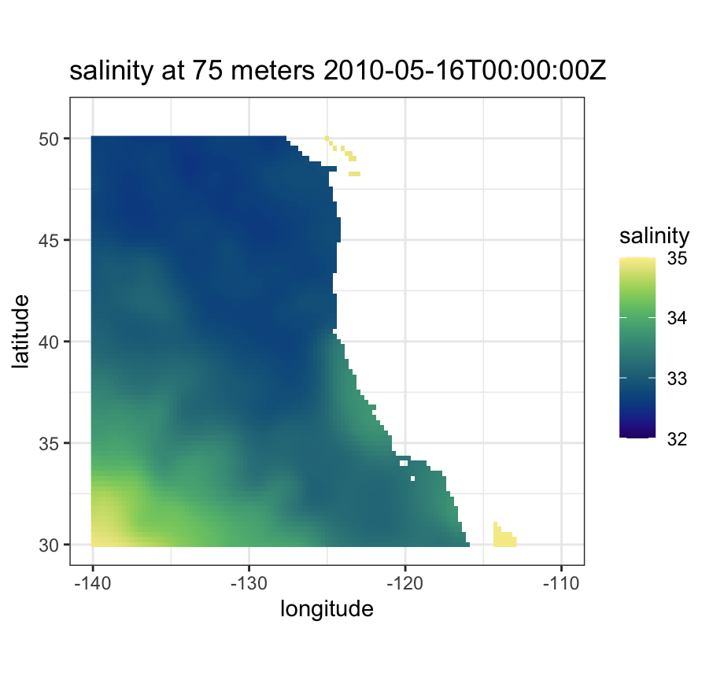

### `tabledap()` examples

#### CalCOFI data

CalCOFI (California Cooperative Oceanic Fisheries Investigations -
<https://calcofi.org>) is a multi-agency partnership formed in 1949 to
investigate the collapse of the sardine population off California. The
organization’s members are from NOAA Fisheries Service, Scripps
Institution of Oceanography, and California Department of Fish and
Wildlife. The scope of this research has evolved into the study of
marine ecosystems off California and the management of its fisheries
resources. The nearly complete CalCOFI data, both physical and
biological, are available through ERDDAP™.

The following example is a modification of a script developed by
Dr. Andrew Leising of the Southwest Fisheries Science Center. The
original script has been used to automate the generation of several
yearly reports about the California Current Ecosystem. The script gets
chlorophyll data and a measure of primary productivity from the
hydrocasts, and then calculates a seasonally adjusted chlorophyll
anomaly as well as a seasonally adjusted primary productivity anomaly.
The first step is to get the information about the particular dataset:

``` r

require("rerddap")
hydroInfo <- info('siocalcofiHydroCast')
```

and then obtain the desired data from 1984 through 2014:

``` r

require("rerddap")
calcofi.df <- tabledap(hydroInfo, fields = c('cst_cnt',  'date', 'year', 'month', 'julian_date', 'julian_day', 'rpt_line', 'rpt_sta', 'cruz_num', 'intchl', 'intc14', 'time'), 'time>=1984-01-01T00:00:00Z', 'time<=2014-04-17T05:35:00Z')
```

In versions of ‘rerddap’ before v1.1.0, “intchl” and “intC14” are
returned as character strings, and are easier to work with as numbers,
so in earlier versions of you need to:

``` r

if (packageVersion('rerddap') < '1.1.0'){
    calcofi.df$cruz_num <- as.numeric(calcofi.df$cruz_num)
    calcofi.df$intc14 <- as.numeric(calcofi.df$intc14)
    calcofi.df$time <- as.Date(calcofi.df$time, origin = '1970-01-01', tz = "GMT")
}
```

At this point the requested data are in the R workspace - the rest of
the code performs the calculations to derive the seasonally adjusted
values and plot them.

``` r

require("dplyr")

# calculate cruise means
by_cruznum <- group_by(calcofi.df, cruz_num)
tempData <- select(by_cruznum, year, month, cruz_num, intchl, intc14)
CruiseMeans <- summarize(by_cruznum, cruisechl = mean(intchl, na.rm = TRUE), cruisepp = mean(intc14, na.rm = TRUE), year = median(year, na.rm = TRUE), month = median(month, na.rm = TRUE))
tempTimes <- paste0(CruiseMeans$year,'-',CruiseMeans$month,'-1')
cruisetimes <- as.Date(tempTimes, origin = '1970-01-01', tz = "GMT")
CruiseMeans$cruisetimes <- cruisetimes
# calculate monthly "climatologies"
byMonth <- group_by(CruiseMeans, month)
climate <- summarize(byMonth, ppClimate = mean(cruisepp, na.rm = TRUE), chlaClimate = mean(cruisechl, na.rm = TRUE))
# calculate anomalies
CruiseMeans$chlanom <- CruiseMeans$cruisechl - climate$chlaClimate[CruiseMeans$month]
CruiseMeans$ppanom <- CruiseMeans$cruisepp - climate$ppClimate[CruiseMeans$month]
# calculate mean yearly anomaly
byYear <- select(CruiseMeans, year)
tempData <- select(CruiseMeans, year, chlanom, ppanom )
byYear <- group_by(tempData, year)
yearlyAnom <- summarize(byYear, ppYrAnom = mean(ppanom, na.rm = TRUE), chlYrAnom = mean(chlanom, na.rm = TRUE))
yearlyAnom$year <- ISOdate(yearlyAnom$year, 01, 01, hour = 0)
ggplot(yearlyAnom, aes(year, chlYrAnom)) + geom_line() +
  theme_bw() + ggtitle('yearly chla anom')
ggplot(yearlyAnom, aes(year, ppYrAnom)) + geom_line() +
  theme_bw() + ggtitle('yearly pp anom')
```

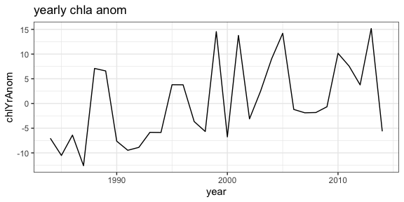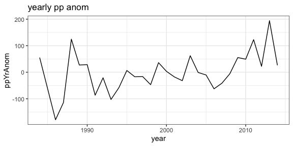

#### Parquet files

A new feature in
[`tabledap()`](https://docs.ropensci.org/rerddap/reference/tabledap.md)
is the option to download the data as a parquet file rather than as a
csv file - the parquet file can be up to 90% smaller in our tests (note
this will only work if the ERDDAP™ server is at least version 2.25,
otherwise the program will throw an error). As an example, for the
CalCOFI extract above:

``` r

require("rerddap")
calcofi.df <- tabledap(hydroInfo, fields = c('cst_cnt',  'date', 'year', 'month', 'julian_date', 'julian_day', 'rpt_line', 'rpt_sta', 'cruz_num', 'intchl', 'intc14', 'time'), 'time>=1984-01-01T00:00:00Z', 'time<=2014-04-17T05:35:00Z', fmt = 'parquet')
```

#### CPS Trawl Surveys

The CPS (Coastal Pelagic Species) Trawl Life History Length Frequency
Data contains the length distribution of a subset of individuals from a
species (mainly non-target) caught during SWFSC-FRD fishery independent
trawl surveys of coastal pelagic species. Measured lengths for indicated
length type (fork, standard, total, or mantle) were grouped in 10 mm
bins (identified by the midpoint of the length class) and counts are
recorded by sex.

The number and location of sardines (Sardinops sagax) in the tows in
March 2010 and 2011 are extracted, and compared with monthly SST from
satellites. First, query the ERDDAP™ server to see if CPS Trawl data are
available through the ERDDAP™ server, and if so, obtain the datasetID
for the dataset.

``` r

require("rerddap")
CPSquery <- ed_search(query = 'CPS Trawl')
CPSquery$alldata[[1]]$summary
CPSquery$alldata[[1]]$tabledap
CPSquery$alldata[[1]]$dataset_id
```

Then get the information for the CPS dataset:

``` r

require("rerddap")
CPSinfo <- info('FRDCPSTrawlLHHaulCatch')
```

extract the desired CPS data:

``` r

require("dplyr")
require("rerddap")
sardines <- tabledap(CPSinfo, fields = c('latitude',  'longitude', 'time', 'scientific_name', 'subsample_count'), 'time>=2010-01-01', 'time<=2012-01-01', 'scientific_name="Sardinops sagax"' )
if (packageVersion('rerddap') < '1.1.0'){
    sardines$time <- as.Date(sardines$time, origin = '1970-01-01', tz = "GMT")
    sardines$latitude <- as.numeric(sardines$latitude)
    sardines$longitude <- as.numeric(sardines$longitude)
}
sardines$time <- as.Date(sardines$time, origin = '1970-01-01', tz = "GMT")
sardines$latitude <- as.numeric(sardines$latitude)
sardines$longitude <- as.numeric(sardines$longitude)
sardine2010 <- filter(sardines, time < as.Date('2010-12-01'))
```

and plot the data versus monthly SST values:

``` r

# get the dataset info
sstInfo <- info('erdMWsstdmday')
# get 201004 monthly sst
sst201004 <- griddap('erdMWsstdmday', latitude = c(22., 51.), longitude = c(220., 255), time = c('2010-04-16','2010-04-16'), fields = 'sst')
# get 201104 monthly sst
sst201104 <- griddap('erdMWsstdmday', latitude = c(22., 51.), longitude = c(220., 255), time = c('2011-04-16','2011-04-16'), fields = 'sst')
```

``` r

# get polygons of coast for this area
w <- map_data("worldHires", ylim = c(22., 51.), xlim = c(220 - 360, 250 - 360))
# plot 201004 sst on the map
sardine2010 <- filter(sardines, time < as.Date('2010-12-01', origin = '1970-01-01', tz = "GMT"))
sardine2011 <- filter(sardines, time > as.Date('2010-12-01', origin = '1970-01-01', tz = "GMT"))
mycolor <- colors$temperature
p1 <- ggplot() +
  geom_polygon(data = w, aes(x = long, y = lat, group = group), fill = "grey80") +
  geom_raster(data = sst201004$data, aes(x = (longitude - 360), y = latitude, fill = sst), interpolate = FALSE) +
  scale_fill_gradientn(colours = mycolor, na.value = NA, limits = c(5,30)) +
  theme_bw() + ylab("latitude") + xlab("longitude") +
  coord_fixed(1.3, xlim = c(220 - 360, 250 - 360),  ylim = c(22., 51.))

# plot 201104 sst on the map
p2 <- ggplot() +
  geom_polygon(data = w, aes(x = long, y = lat, group = group), fill = "grey80") +
  geom_raster(data = sst201104$data, aes(x = (longitude - 360), y = latitude, fill = sst), interpolate = FALSE) +
  geom_point(data = sardine2011, aes(x = longitude, y = latitude, colour = subsample_count)) +
  scale_fill_gradientn(colours = mycolor, na.value = NA, limits = c(5,30)) +
  theme_bw() + ylab("latitude") + xlab("longitude") +
  coord_fixed(1.3, xlim = c(220 - 360, 250 - 360),  ylim = c(22., 51.))
p1 + geom_point(data = sardine2010, aes(x = longitude, y = latitude, colour = subsample_count)) + scale_colour_gradient(space = "Lab", na.value = NA, limits = c(0,80))

p2 +   geom_point(data = sardine2011, aes(x = longitude, y = latitude, colour = subsample_count)) + scale_colour_gradient(space = "Lab", na.value = NA, limits = c(0,80))
```

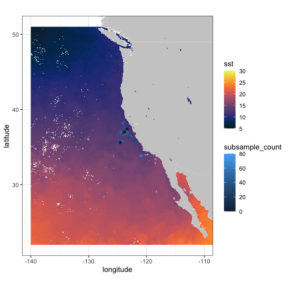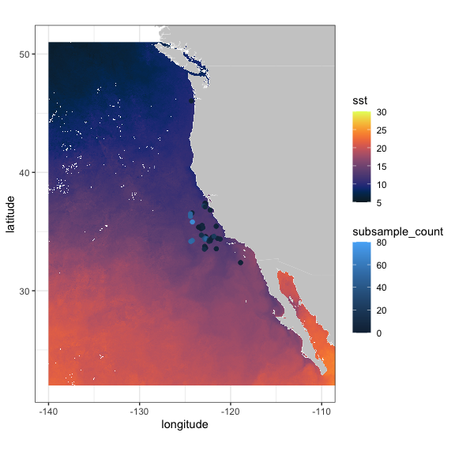

Also of interest is the distribution of sardines through the years:

``` r

sardinops <- tabledap(CPSinfo, fields = c('longitude', 'latitude', 'time'),  'scientific_name="Sardinops sagax"')
if (packageVersion('rerddap') < '1.1.0') {
    sardinops$time <- as.Date(sardinops$time, origin = '1970-01-01', tz = "GMT")
    sardinops$year <- as.factor(format(sardinops$time, '%Y'))
    sardinops$latitude <- as.numeric(sardinops$latitude)
    sardinops$longitude <- as.numeric(sardinops$longitude)
}
sardinops$year <- as.factor(format(sardinops$time, '%Y'))
```

``` r

xlim <- c(-135, -110)
ylim <- c(30, 51)
coast <- map_data("worldHires", ylim = ylim, xlim = xlim)
ggplot() +
    geom_point(data = sardinops, aes(x = longitude, y = latitude, colour = year)) +
    geom_polygon(data = coast, aes(x = long, y = lat, group = group), fill = "grey80") +
    theme_bw() + ylab("latitude") + xlab("longitude") +
    coord_fixed(1.3, xlim = xlim, ylim = ylim) +
    ggtitle("Location of sardines by year in EPM Trawls")
```

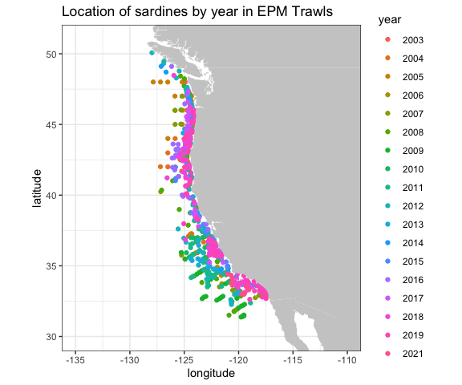

#### NDBC Buoys

NOAA’s National Data Buoy Center (NDBC) collects world-wide data from
buoys in the ocean. ERDDAP™ can be searched for the location of all
buoys in a bounding box with latitudes(37N, 47N) and longitudes (124W,
121W) and the results plotted:

``` r

# get location and station ID of NDBC buoys in a region
BuoysInfo <- info('cwwcNDBCMet')
locationBuoys <- tabledap(BuoysInfo, distinct = TRUE, fields = c("station", "longitude", "latitude"), "longitude>=-124", "longitude<=-121", "latitude>=37", "latitude<=47")
if (packageVersion('rerddap') < '1.1.0') {
   locationBuoys$latitude <- as.numeric(locationBuoys$latitude)
   locationBuoys$longitude <- as.numeric(locationBuoys$longitude)
}
```

``` r

xlim <- c(-130, -110)
ylim <- c(35, 50)
coast <- map_data("worldHires", ylim = ylim, xlim = xlim)
ggplot() +
   geom_point(data = locationBuoys, aes(x = longitude , y = latitude, colour = factor(station) )) +
   geom_polygon(data = coast, aes(x = long, y = lat, group = group), fill = "grey80") +
   theme_bw() + ylab("latitude") + xlab("longitude") +
   coord_fixed(1.3, xlim = xlim, ylim = ylim) +
   ggtitle("Location of buoys in given region")
```

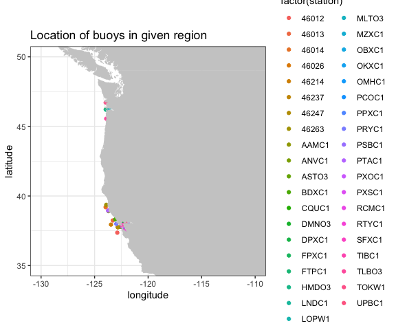

Looking at wind speed for 2012 for station “46012”

``` r

buoyData <- tabledap(BuoysInfo, fields = c("time", "wspd"), 'station="46012"', 'time>=2012-01-01', 'time<=2013-01-01')
if (packageVersion('rerddap') < '1.1.0') {
    buoyData$wspd <- as.numeric(buoyData$wspd)
    buoyData$time <- as.Date(buoyData$time, origin = '1970-01-01', tz = "GMT")
}
```

``` r

ggplot(buoyData, aes(time, wspd)) + 
  geom_line() + 
  theme_bw() + 
  ylab("wind speed") +
  ggtitle("Wind Speed in 2012 from buoy 46012 ")
```

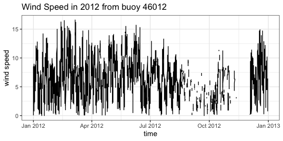

#### IOOS Glider Data

The mission of the IOOS Glider DAC is to provide glider operators with a
simple process for submitting glider data sets to a centralized
location, enabling the data to be visualized, analyzed, widely
distributed via existing web services and the Global Telecommunications
System (GTS) and archived at the National Centers for Environmental
Information (NCEI). The IOOS Glider Dac is accessible through `rerddap`
(<https://gliders.ioos.us/erddap/index.html>). Extracting and plotting
salinity from part of the path of one glider deployed by the Scripps
Institution of Oceanography:

``` r

urlBase <- "https://data.ioos.us/gliders/erddap/"
gliderInfo <- info("sp064-20161214T1913",  url = urlBase)
glider <- tabledap(gliderInfo, fields = c("longitude", "latitude", "depth", "salinity"), 'time>=2016-12-14', 'time<=2016-12-23', url = urlBase)
if (packageVersion('rerddap') < '1.1.0') {
    glider$longitude <- as.numeric(glider$longitude)
    glider$latitude <- as.numeric(glider$latitude)
    glider$depth <- as.numeric(glider$depth)
}
```

``` r

require("plot3D")
scatter3D(x = glider$longitude , y = glider$latitude , z = -glider$depth, colvar = glider$salinity,              col = colors$salinity, phi = 40, theta = 25, bty = "g", type = "p",
           ticktype = "detailed", pch = 10, clim = c(33.2,34.31), clab = 'Salinity',
           xlab = "longitude", ylab = "latitude", zlab = "depth",
           cex = c(0.5, 1, 1.5))
```

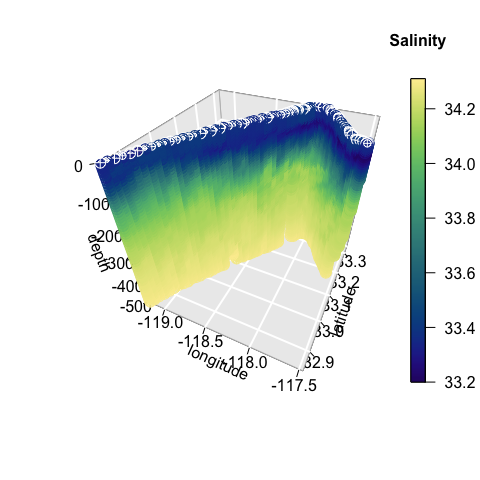

#### Animal Telemetry Network (ATN)

The Integrated Ocean Observing System Animal Telemetry Network (IOOS
ATN) is designed to serve as an access point to search, discover and
access animal telemetry data, and associated oceanographic datasets,
from a wide variety of species and platforms. The track of one of the
tagged animals is extracted, and plotted with SST value from satellite
along the track.

``` r

atnURL <- 'https://oceanview.pfeg.noaa.gov/erddap/'
atnInfo <- info('gtoppAT', url = atnURL)
atnData <- tabledap(atnInfo, fields = c("time", "longitude", "latitude"), 'toppID="1807001"', url = atnURL)
atnData$latitude <- as.numeric(atnData$latitude)
atnData$longitude <- as.numeric(atnData$longitude)
ncdcSST = array(NA_real_, dim = length(atnData$time))
ncdcSSTInfo = info('ncdcOisst2Agg')
time_bound <- c(as.character(atnData$time[1]), as.character(atnData$time[66]))
for (i in 1:length(atnData$time)) {
  extract <- griddap(ncdcSSTInfo, 
                     fields = 'sst', 
                     latitude = c(atnData$latitude[i], atnData$latitude[i]), 
                     longitude = c(atnData$longitude[i], atnData$longitude[i]), 
                     time = time_bound
                     )
ncdcSST[i] <- extract$data$sst
}
```

``` r

ylim <- c(32.5, 34)
xlim <- c(-119, -116.5)
mycolor <- colors$temperature
w <- map_data("worldHires", ylim = ylim, xlim = xlim)
alldata <- data.frame(sst = ncdcSST, longitude = atnData$longitude - 360, latitude = atnData$latitude)
z <- ggplot(alldata, aes(x = longitude, y = latitude)) +
   geom_point(aes(colour = sst), size = .5)
z + geom_polygon(data = w, aes(x = long, y = lat, group = group), fill = "grey80") +
  theme_bw() +
  scale_colour_gradientn(colours = mycolor, limits = c(16.9, 17.3), "SST") +
  coord_fixed(1.3, xlim = xlim, ylim = ylim) + ggtitle("SST Along Track")
```

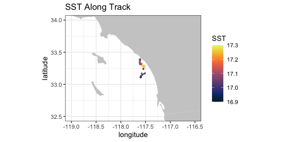

#### California Current System Integrated Ecosystem Assessment (CCSIEA)

The primary goals of the CCIEA are to better understand the web of
interactions that drive patterns and trends of components within the
California Current ecosystem, and forecast how changing environmental
conditions and management actions affect the status of these components.
The conceptual model of the social-ecological system of the California
Current illustrates how humans and their social systems are inextricably
linked to these marine, coastal, and upland environments (see
(“www.integratedecosystemassessment.noaa.gov/regions/california-current/projects”).

The over 300 indices developed for the CCSIEA are available through
`rerddap`. Here an index of coho abundance in California is compared
with the February value of an index of the strength and location of the
North Pacific High, developed in “The North Pacific High and wintertime
pre-conditioning of California current productivity” by Schroeder et
al. (Geophys. Res. Lett., 40, 541–546).

``` r

urlBase <- 'https://coastwatch.pfeg.noaa.gov/erddap/'
nphInfo <- info('erdNph', url = urlBase)
nphData <- tabledap(nphInfo, fields = c("year", "maxSLP" ), 'month=2', 'year>=1987', url = urlBase)
nphData$maxSLP <- as.numeric(nphData$maxSLP)
urlBase <- 'https://oceanview.pfeg.noaa.gov/erddap/'
cohoInfo <- info('cciea_SM_CA_CO_ABND', url = urlBase)
cohoData <- tabledap(cohoInfo, fields = c("abundance_anomaly", "time"),  url = urlBase)
if (packageVersion('rerddap') < '1.1.0') {
    cohoData$abundance_anomaly <- as.numeric(cohoData$abundance_anomaly)
}
alldata <- data.frame(coho = cohoData$abundance_anomaly[1:27], maxSLP = nphData$maxSLP, year = nphData$year)
```

``` r

ggplot(alldata) + geom_line(aes(x = year, y = coho), colour = 'blue') + theme_bw() + ggtitle("coho abundance anomaly")
ggplot(alldata) + geom_line(aes(x = year, y = maxSLP), colour = 'red') + theme_bw() + ggtitle("MaxSLP")
```

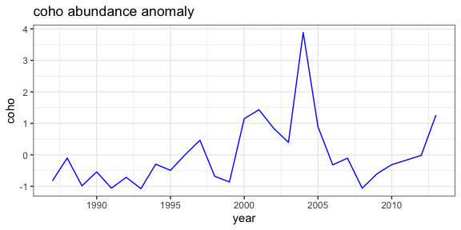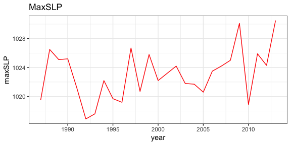 \## Additional information

### Interactive plots

The `plotdap` plotting package has a new version of the function
“box_set()” which can both reset the limits of the plot as well as
return a `ggplot2` object that works with the `plotly` function
“ggplotly()” to produce an interactive plot.

“box_set()” has the form:

``` r

bbox_set <- function(plotobj, landmask = TRUE, xlim = NULL, ylim = NULL, interactive = FALSE)
```

If the values for “xlim” and “ylim” are not given, then the function
will determine the limits and projection of the `plotdap` object, and
set this in the `ggplot2` part of the the `plotdap` object. If
“interactive” is set to “TRUE”, then a `ggplot2` object is returned that
works properly with the function
[`plotly::ggplotly()`](https://rdrr.io/pkg/plotly/man/ggplotly.html).

``` r

library(plotly)

myURL <- "https://coastwatch.pfeg.noaa.gov/erddap/"

sstInfo <- rerddap::info('erdVHsstaWS3day', url = myURL)
# get latest 3-day composite sst
viirsSST <- rerddap::griddap(sstInfo, 
                             latitude = c(41., 31.), 
                             longitude = c(-128., -115), 
                             time = c('last','last'), 
                             fields = 'sst')

w <- map("worldHires", xlim = c(-140., -114), ylim = c(30., 42.), fill = TRUE, plot = FALSE)
my_plot <- plotdap::add_griddap(plotdap::plotdap(mapData = w), viirsSST, ~sst, fill = "thermal" )

my_plot1 <- plotdap::bbox_set(my_plot, xlim = c(-128., -115), ylim = c(31, 41.), interactive = TRUE)

# must have '"tooltip = "text"' to work properly.
plotly::ggplotly(my_plot1, tooltip = "text")
```

The resulting plot is an interactive plot that as you mouse over the
data will display the latitude, longitude and value at the point. As the
plot takes a long time to create and is quote large, both of which cause
problems with CRAN, it is not displayed here.

### Passing an extract to the `terra` package or other packages that use “GDAL” - do so with care.

A common workflow is to pass the result of a
[`griddap()`](https://docs.ropensci.org/rerddap/reference/griddap.md) to
the `terra` package or similar packages for further analysis or
plotting. This can run into several problems that you have to be aware
of and check for, because “GDAL” makes many assumptions about the data
rather than reading in the available information. Some of the issues
include:

- `terra::raster()` thinks the grid is irregular even though it is not.
- `terra::raster()` does not like data on a (0, 360) longitude grid
- `terra::raster()` flips one of the axis.
- `terra::raster()`assumes the grid values represent cell centers while
  the underlying dataset may assume the grid values are edges. Then a
  map may be offset by one-half pixel value.

A first possible solution to an irregular grid is to try reading in the
data directly from the downloaded file, which is stored in a temporary
space. If say for the viirsSST example you do “str(viirsSST)” at the
bottom you will see a line beginning “- attr(\*, “path”)= chr ” which
gives the location of the downloaded file.

If that doesn’t work and you know the resolution of the dataset you can
try setting the coordinates explicitly based on the bounds and the
dataset resolution. If there are still problems you can try using two
internal functions from the `plotdap` package, for example:

``` r

r <- plotdap:::get_raster(viirsSST, ~sst)
r <- plotdap:::latlon_adjust(r)
```

### Cacheing, “last”, “now”, idempotency, and a gotcha

`rerddap` by default caches the requests you make, so that if you happen
to make the same request again, the data is restored from the cache,
rather than having to go out and retrieve it remotely. For most
applications, this a boon (such as when “knitting” and “re-knitting”
this document), as it can speed things up when doing a lot of request in
a script, and works because in most cases an ERDDAP™ request is
“idempotent”. This means that the the request will always return the
same thing no matter what requests came before - it doesn’t depend on
state. However this is not true if the script uses either “last” in
[`griddap()`](https://docs.ropensci.org/rerddap/reference/griddap.md) or
“now” in
[`tabledap()`](https://docs.ropensci.org/rerddap/reference/tabledap.md)
as these will return different values as time elapses and data are added
to the datasets. While it is desirable to have ERDDAP™ purely
idempotent, the “last” and “now” constructs are very helpful for people
using ERDDAP™ in dashboards, webpages, regular input to models and the
like, and the benefits far outweigh the problems. However, if you are
using either “last” or “now” in an `rerddap` based script, you want to
be very careful to clear the `rerddap` cache, otherwise the request will
be viewed as the same, and the data from the last request, rather than
the latest data, will be returned. Note that several examples in this
vignette use “last”, and therefore the graphics may look different
depending on when you “knitted” the vignette.

For help in dealing with the cache, see:

``` r

?cache_delete
?cache_delete_all
?cache_details
?cache_list
```

### Reading data from a netCDF file.

Here we give a brief summary of how to read in part of the data from a
netCDF file. The basic steps are:

- Open the netCDF file
- Map coordinate values to array indices
- Extract the data

A sample netCDF file, “MWsstd1day.nc” is included. This is a small file
and is a toy example, but the basic principles remain the same for a
larger file.

Open the netCDF file:

``` r

require("ncdf4")
#> Loading required package: ncdf4
exampleFile <- system.file("extdata", "MWsstd1day.nc", package = "rerddap")
sstFile <- nc_open(exampleFile)
```

While it is possible to obtain the coordinate values by extracting them
from the file, `ncdf4` by default does so automatically in `nc_open`.
The names of the coordinate dimensions can be found from:

``` r

names(sstFile$dim)
#> [1] "time"      "altitude"  "latitude"  "longitude"
```

(note that the coordinate names here are given in ‘C’ order, while for
an extract the coordinates will be in the opposite, “Fortran” order) and
the values of any coordinate, say longitude, can be found from:

``` r

sstFile$dim$longitude$vals
#>  [1] 210.0000 210.0125 210.0250 210.0375 210.0500 210.0625 210.0750 210.0875
#>  [9] 210.1000 210.1125 210.1250 210.1375 210.1500 210.1625 210.1750 210.1875
#> [17] 210.2000 210.2125 210.2250 210.2375 210.2500 210.2625 210.2750 210.2875
#> [25] 210.3000 210.3125 210.3250 210.3375 210.3500 210.3625 210.3750 210.3875
#> [33] 210.4000 210.4125 210.4250 210.4375 210.4500 210.4625 210.4750 210.4875
#> [41] 210.5000 210.5125 210.5250 210.5375 210.5500 210.5625 210.5750 210.5875
#> [49] 210.6000 210.6125 210.6250 210.6375 210.6500 210.6625 210.6750 210.6875
#> [57] 210.7000 210.7125 210.7250 210.7375 210.7500 210.7625 210.7750 210.7875
#> [65] 210.8000 210.8125 210.8250 210.8375 210.8500 210.8625 210.8750 210.8875
#> [73] 210.9000 210.9125 210.9250 210.9375 210.9500 210.9625 210.9750 210.9875
#> [81] 211.0000
```

The names of the variables in the netCDF file can be found from:

``` r

names(sstFile$var)
#> [1] "sst"
```

An extract is done by giving the pointer to the netCDF file (“sstFile”
in this instance), the name of the variable to be extracted (“sst” in
this instance), the starting index value (in array coordinates) for each
dimension, and the the count (the number of other index values) to
include. If all values of a particular dimension are wanted, then “-1”
can be used for the count. So for example to extract all of the values
for the first day:

``` r

require("ncdf4")
day1SST <- ncvar_get(sstFile, "sst", start = c(1, 1, 1, 1), count = c(1, 1, -1, -1))
```

Suppose we only want the latitudes from (30.0, 30.5) and longitudes
(210.0, 210.5) for the first day. We need to find the array indices that
match those coordinate values:

``` r

latMin <- which(sstFile$dim$latitude$vals == 30.0)
latMax <- which(sstFile$dim$latitude$vals == 30.5)
lonMin <- which(sstFile$dim$longitude$vals == 210.0)
lonMax <- which(sstFile$dim$longitude$vals == 210.5)
```

and then extract the data:

``` r

require("ncdf4")
day1SST <- ncvar_get(sstFile, "sst", start = c(lonMin, latMin, 1, 1), count = c( (lonMax - lonMin + 1), (latMax - latMin + 1), 1, 1 ))
```

If we wanted a time series at (30N, 210E) it would be:

``` r

require("ncdf4")
day1SST <- ncvar_get(sstFile, "sst", start = c(lonMax, latMin, 1, 1), count = c(1, 1, 1, -1 ))
```

For this example, it is easy to visually peruse the dimension values but
for a large extract this might not be the possible. Suppose we wanted
all values in a latitude range or (30.1, 30.3) and since the range of
values we are interested in might not be on a grid boundary we want the
smallest range that would include these values (that is if not on the
grid then the smallest value may be less than 30.1) and similarly for
longitude, say (210.1, 210.3):

``` r

latMin <- max(which(sstFile$dim$latitude$vals <= 30.1))
latMax <- min(which(sstFile$dim$latitude$vals >= 30.3))
lonMin <- max(which(sstFile$dim$longitude$vals <= 210.1))
lonMax <- min(which(sstFile$dim$longitude$vals >= 210.3))
```

and then perform the extract as before:

``` r

require("ncdf4")
day1SST <- ncvar_get(sstFile, "sst", start = c(lonMin, latMin, 1, 1), count = c( (lonMax - lonMin + 1), (latMax - latMin + 1), 1, 1 ))
```
